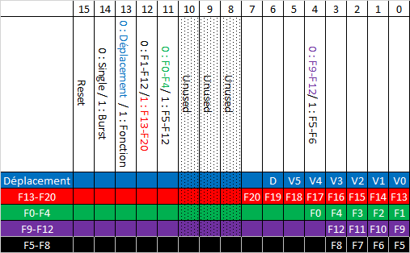

# MU4IN108 : Développement d'une centrale DCC sur FPGA

## Sommaire
- [MU4IN108 : Développement d'une centrale DCC sur FPGA](#mu4in108--développement-dune-centrale-dcc-sur-fpga)
  - [Sommaire](#sommaire)
  - [Fonctionalités finales extérieures](#fonctionalités-finales-extérieures)
  - [Architecture générale](#architecture-générale)
  - [Générateur de trame](#générateur-de-trame)
    - [Générateur de motif](#générateur-de-motif)
    - [Registre DCC](#registre-dcc)
    - [Système de contrôle](#système-de-contrôle)
  - [Vérification par testbenchs](#vérification-par-testbenchs)
  - [Intégration avec microblaze](#intégration-avec-microblaze)
    - [Structure générale du code](#structure-générale-du-code)
    - [Génération des trames par les fonctions support](#génération-des-trames-par-les-fonctions-support)
    - [Interprétation des entrées physiques et décision de la trame à produire](#interprétation-des-entrées-physiques-et-décision-de-la-trame-à-produire)
    - [Indications visuelles d'activité](#indications-visuelles-dactivité)
  - [Ajouts par initiative](#ajouts-par-initiative)

## Fonctionalités finales extérieures
L'objectif principal de ce mini projet était de proposer une implémentation sur FPGA d'un système capable de générer les trames de contrôle des trains miniatures contrôlés numériquement, et compatibles avec le standard DCC, pour "Digital Command Control".  
Parmi les commandes à implémenter, on retrouve les déplacements, composés d'une direction, et d'une vitesse; et les fonctions, qui permettent notamment de gérer les effets sonores, et d'éclairage.  
Dans notre implémentation, nous permettons de commander n'importe quelle vitesse et direction, et les commandes 0 à 20, pour n'importe quelle locomotive dont l'adresse est comprise entre 0 et 9.  
Ci-dessous est représenté un schéma indiquant les différents contrôles pour choisir la commande à envoyer :

Une fois la commande sélectionnée, on peut utiliser les boutons haut et bas pour choisir le numéro de la locomotive à laquelle envoyer la commande. Le numéro de la locomotive actuellement sélectionnée est affiché sur les afficheurs 7 segments.  
Une fois toutes les informations sélectionnées, on valide la trame par un appui sur le bouton central.  
La trame est alors envoyée, et sera répétée indéfiniment tant qu'une autre trame n'aura aps été validée. La commande actuellement validée est affichée par l'intermédiaire des LEDs associées aux interrupteurs.

Lien vers la démonstration sur maquette : https://www.youtube.com/watch?v=Spwa2BjbLnY

## Architecture générale
L'agencement global correspond à celle proposée : un CPU microblaze est implémenté pour générer les trames, et est relié aux composants de décodage (DCC_Core) via un bus AXI et des Slave Registers, tel qu'illustré ci-dessous : 

Ces composants de décodage consistent en :
- Un registre à décalage et chargement parallèle qui prend en entrée la trame complète, et donne en sortie le bit de poids faible.
- Un module générant un motif "1" unique (sans répétition tant que le signal de commande n'est pas repassé au moins une fois à 0) conforme au standard DCC (58µs à l'état bas suivi de 58µs à l'état haut).
- Un module générant un motif "0" unique (sans répétition tant que le signal de commande n'est pas repassé au moins une fois à 0) conforme au standard DCC (100µs à l'état bas suivi de 100µs à l'état haut).
- Un module de contrôle, basé sur une machine à états, dont le rôle principal est de commander l'émission des motifs "1" et "0" via les modules de génération, et de décider du comportement du registre à décalage (chargement parallèle ou décalage d'un rang vers la droite) en fonction des temporisations prescrites par le standard DCC.
- Un compteur de temporisation, qui met son signal de sortie à "1" 6ms après son lancement. Il sert à gérer les 6ms de délai requis par le standard DCC entre deux frames.
- Un diviseur d'horloge, de 100MHz vers 1MHz pour simplifier l'implémentation des temporisations et des générateurs de motif.

A côté de ces éléments logiques, on dispose de deux modules GPIO : 
- gpio_inputs, qui contient deux registres AXI pour lire les valeurs des interrupteurs et des boutons (connectés aux ports sw et bt respectivement)
- gpio_outputs, qui contient deux registres AXI pour contrôler les LEDs et les afficheurs 7 segments (connectés aux ports leds et afficheur respectivement)

Les trames finales sortent du système directement depuis DCC_Core via le port SORTIE_DCC, dans un soucis de réduction de la latence. En effet, passer par le bus AXI, le microblaze, puis un module GPIO introduirait des délais difficiles à prédire.

## Générateur de trame
On s'intéressera ici au modules réalisant une fonction directement souhaitée, et nous ignorerons donc les modules de "facilitation", c'est à dire le diviseur d'horloge et le compteur de temporisation d'attente inter-trame
### Générateur de motif
Les générateurs de motif sont construits autour d'un compteur, et d'une machine à états dont le diagramme est ci-dessous : 

Ce diagramme fonctionne pour les deux générateurs, avec des valeurs différentes pour Cpt (le compteur de temporisation), comme indiqué ci dessous :  
Pour le générateur de motif "0"
| Transition | Etat associé | Condition          | DCC_0 | FIN_0 |
| :--------- | :----------- | :----------------- | :---- | :---- |
| A          | IDLE         | $GO\_0$            | 0     | 0     |
| B          | ENVOIE_0     | $Cpt = 99$         | 0     | 0     |
| C          | ENVOIE_1     | $Cpt \geqq 200$    | 1     | 0     |
| D          | FIN          | $\overline{GO\_0}$ | 0     | 1     |

Et pour le générateur de motif "1"
| Transition | Etat associé | Condition          | DCC_0 | FIN_0 |
| :--------- | :----------- | :----------------- | :---- | :---- |
| A          | IDLE         | $GO\_1$            | 0     | 0     |
| B          | ENVOIE_0     | $Cpt = 57$         | 0     | 0     |
| C          | ENVOIE_1     | $Cpt \geqq 116$    | 1     | 0     |
| D          | FIN          | $\overline{GO\_1}$ | 0     | 1     |

### Registre DCC
Le registre DCC est simplement composé d'un registre de 51 bits à reset asynchrone. Hors reset, celui-ci interprète deux bits de commande : load et shift. Lors du load, le module copie l'état de son entrée de 51 bits dans son registre interne. Lors d'un shift, le registre interne est décalé d'un rang vers la droite au cycle suivant. Les loads sont prioritaires sur les shifts, et le bit de sortie est une copie combinatoire du bit de poids faible du registre interne.

Il est à noter ici que, compte tenu de la taille des trames et des registres AXI, l'usage de deux registres a été nécessaire. A cet effet, le registre AXI0 associé à ce module est relié aux 32 bits de poids faible, et le registre AXI1 associé à ce module est relié aux 19 bits de poids fort.

### Système de contrôle
Le module de contrôle est organisé autour d'un compteur et d'une machine à états dont le diagramme est donné ci-dessous :  

Il dispose de la table de transition suivante:

| Transition | Etat associé | Condition                                    |
| :--------- | :----------- | :------------------------------------------- |
| A          | Tempo        | $Fin\_Tempo \cdot data\_reg\_dcc$            |
| B          | ENVOIE_1     | $nb\_sent < 51$                              |
| C          | End_Bit      | $data\_reg\_dcc$                             |
| D          | ENVOIE_1     | $nb\_sent \geqq 51$                          |
| E          | Tempo        | $Fin\_Tempo \cdot \overline{data\_reg\_dcc}$ |
| F          | ENVOIE_0     | $nb\_sent < 51$                              |
| G          | End_Bit      | $\overline{data\_reg\_dcc}$                  |
| H          | ENVOIE_0     | $nb\_sent \geqq 51$                          |

Et de la table des sorties suivantes:
| Etat      | Start_Tempo | Go_0                                         | Go_1                              | COM_REG | is_tempo | Count |
| :-------- | :---------- | :------------------------------------------- | :-------------------------------- | :------ | :------- | :---- |
| Tempo     | '1'         | $Fin\_Tempo \cdot \overline{data\_reg\_dcc}$ | $Fin\_Tempo \cdot data\_reg\_dcc$ | "01"    | '1'      | '0'   |
| Envoie_0  | '0'         | '1'                                          | '0'                               | "00"    | '0'      | '0'   |
| Envoie_1  | '0'         | '0'                                          | '1'                               | "00"    | '0'      | '0'   |
| End_Bit   | '0'         | '0'                                          | '0'                               | "00"    | '0'      | '0'   |
| Shift_Reg | '0'         | '0'                                          | '0'                               | "10"    | '0'      | '1'   |

Start_Tempo sert à lancer le module de temporisation de 6ms; Go_0 et Go_1 correspondent aux bits de commande des générateurs de motif; COM_REG est composé des bits shift (rang 0) et load (rang 1) à destination du registre à décalage, is_tempo indique que l'état actuel est celui de temporisation de 6ms (ce signal est géré en dehors du process principal, s'agissant d'un signal supplémentaire par rapport à la spécification de base); et Count sert à incrémenter le compteur "nb_sent".  
On notera ici l'usage du formalisme de Mealy pour les sorties Go_0 et Go_1, toujours dans l'optique de coller au mieux aux tolérances du standard DCC sur la longueur totale des motifs.

## Vérification par testbenchs
Tous les modules ont individuellement été testés en pré-synthèse pour assurer un comportement correct.
En particulier, on souhaite s'assurer en pré-synthèse que les générateurs de motif respectent les tolérances de 3µs à travers les chronogrammes : 

  

  

Les petits délais "irréguliers" au début du motif sont dus à une légère désynchronisation entre la machine à états et le diviseur d'horloge : la première microseconde est systématiquement tronquée d'une valeur dépendant du moment où le signal go_x est mis à 1.

Nous avons également testé le module de contrôle indépendament des autres, pour confirmer a minima que l'ordre des états était correct, et que les sorties étaient générées correctement : 

Pour finir, avec le même testbench, nous avons réalisé des vérifications pré-synthèse en profondeur (inspection des signaux internes à plusieurs niveaux), puis nous avons comparé les sorties finales (uniquement la sortie DCC) de la simulation post-synthèse, pour nous assurer que les descriptions VHDL avaient été interprétées correctement : 

Il est à noter que ces vérifications ont été réalisées à l'aide d'un module combinatoire de substitution au microblaze, qui en fonction des interrupteurs produisait une trame fixe.  
Les ultimes vérifications ont été réalisées via oscilloscope et sur la maquette avec succès pour les 8 commandes préimplémentées dans le générateur de trame de substitution.

## Intégration avec microblaze
Une fois que nous nous sommes assurés que le coeur de la centrale DCC était capable de produire les trames en accord avec le standard (étant donné les 51 bits de la trame en entrée), nous avons intégré ce coeur avec le microblaze comme décrit dans l'architecture globale. Nous avons ensuite entamé la production du code qui permettrait d'interpréter les boutons et interrupteurs de la carte Basys3 pour générer les bits des trames, et les envoyer au coeur de la centrale DCC via les registres et le bus AXI.

### Structure générale du code
Le code est organisé autour du main, qui lit les boutons et switchs, et décide de la commande à envoyer et du destinataire, et de trois fonctions qui prennent cette commande sous la forme d'un octet et organise les bits de deux registres de 32 bits et envoient ces deux registres de 32 bits vers le coeur de la centrale DCC, ainsi que l'adresse de la locomotive ciblée. Ces trois fonctions permettent respectivement d'envoyer les commandes de déplacement, les commandes de fonction sur un octet, et les commandes de fonction sur deux octets (dont le premier est fixe).

### Génération des trames par les fonctions support
Selon que la commande nécessite un octet ou deux, on peut préremplir les registres avec les valeurs fixes : les bits de préambules (14 pour les commandes à 2 octets, 23 pour les commandes à un octet), le bit de stop, les bits de start, et (dans le cas des commandes à  2 octets) le premier octet. Tous les autres bits sont initialisés à 0.
Par la suite, on peut donc additionner l'adresse de la locomotive, soit simplement décalée de 19 bits vers la gauche (commandes à 1 octet), soit découpée et masquée, avec décalage de 28 rangs vers la gauche (4 bits de poids faible dans le registre 0), ou sans décalage (4 bits de poids forts dans le registre 1).  
On additionne ensuite l'octet manquant, directement donné par l'argument cmd, décalé de 10 bits vers la gauche, puis l'octet de vérification (résultat d'un OU exclusif entre l'adresse et l'octet de commande, ou l'adresse, et les deux octets de commande). On envoie finalement les deux registres via le bus.

### Interprétation des entrées physiques et décision de la trame à produire
Après avoir initialisé les entrées et sorties, le main entre dans une boucle infinie. Celle-ci commence par lire les boutons pour décider d'une part si l'adresse de la locomotive doit changer (down pour -1, up pour +1, toujours modulo 10), puis si une nouvelle trame doit être envoyée (si le bouton central a été pressé). Dans les trois cas, on ajoute un système de debounce, avec un délai de 5ms, assorti d'une boucle d'attente de relâchement, pour éviter les trames ne soient recalculées en boucle, ou que l'adresse de la locomotive visée ne change de plus d'une étape à la fois.

Si le bouton central a été pressé, le registres des interrupteurs est lu et masqué pour ne garder que les bits de poids faible. On suit ensuite le schéma de commande donné dans la description générale des fonctionalités pour décider de la fonction à appeler, et remplir la donnée passée en argument, c'est à dire l'octet qui sera ajouté par les fonctions support, qui s'occupent de l'envoi effectif des trames.

### Indications visuelles d'activité
A tout changement d'adresse visée, on écrit dans le registre d'un module GPIO pour mettre à jour l'affichage 7 segments en se basant sur un tableau de valeurs, dont le rang correspond à l'ensemble des bits à écrire pour allumer ou éteindre les segments individuels, ce qui permet un affichage à moindre coût d'un point de vue logique.  
Similairement, dès l'appui sur le bouton central et avant même l'envoi des trames, on recopie l'état des interrupteurs sur les LEDs associées, pour indiquer quelle trame sera transmise. On notera que même les interrupteurs inutilisés sont recopiés sur les LEDs.

## Ajouts par initiative
Une limitation principale du standard DCC est de devoir envoyer plusieurs trames pour contrôler des fonctions différentes n'étant pas dans le même groupe.  
Nous avons donc eu l'idée d'au moins commencer l'implémentation physique et logicielle d'un système permettant par la sélection des interrupteurs d'envoyer une série de trames de façon invisible pour l'utilisateur.  
Nommé mode burst, celui-ci est activé en positionnant l'interrupteur 14 à l'état haut. Lors de la validation de la commande, les switchs seraient lus et interprétés, pour sélectionner successivement 5 trames (une de mouvement, une pour les fonctions F0-F4, une pour les fonctions F5-F8, une pour les fonctions F9-F12, et une pour les fonctions F13-F20).  
Pour réaliser cette fonctionalité, il faut alors pour décider du moment opportun pour charger la trame suivante. Or, le standard DCC implique que les trames ne sont pas de longueur fixe. Il n'est donc pas possible de proprement envoyer une trame sans risquer qu'elle ne soit répétée ou ignorée en utilisant uniquement une temporisation fixe. Nous avons donc ajouté un signal au coeur de la centrale DCC, passé via le bux AXI, qui indique si le coeur est dans l'état de temporisation. Si tel est le cas, on peut écrire la trame suivante, puis attendre le prochain passage par tempo. On vérifie pour cela toutes les 2ms la valeur de ce bit.  
Malheureusement, par manque de temps, nous n'avons pas pu implémenter le code nécessaire à cette réalisation. Mettre l'interrupteur en position burst ne fait donc rien et n'envoie pas de trame. Néanmoins, toute la structure nécessaire est présente pour de futurs développements.